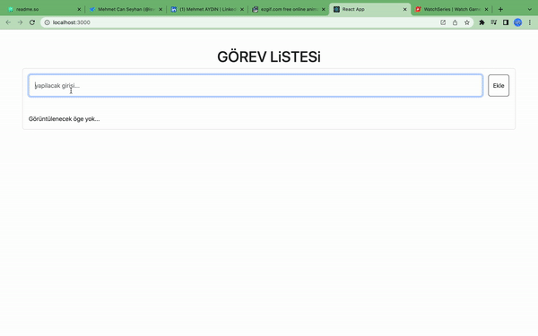

# Project Title

CRUD App
(Create Read Update Delete)
örnek Calisma projesi
## Acknowledgements

 - [Mehmet Can Seyhan (@isvec_krali)](https://twitter.com/isvec_kraIi)
 - [Furkan Evin](https://www.linkedin.com/in/furkan-evin/)

## Yapilacaklar Detay

1- Yeni eklenicek eleman almak için bir form oluştur:

form içerisnden verileri alıp state aktar
daha sonra ekle butonuna tıklanınca forma girilen bilgilerle yeni bir obje oluştur 
oluşturlamn öğede olması gereken bilgiler : tarih , todoText, id , yapıldı mı ? şeklinde statei olsun 
ve bir state a aktar
form içerisindeki yazılanı aldıktan sonra formu sıfırla

2- State bulunan elemanları al ve map ile listele (ekrana bas)
 eğer state içreisinde hiç eleman yoksa ekranda "yapılacak bir şey yok" yazsın

3- Todo silme :

herhnagi todonun  butonun yanındaki sil butonuna tıklanınca
tıklanılan todonun idsine göre todos dizisini filtrle ve silineni gösterme

 4- Todoyu Tamamlama:
hangi todonun yapıldı buyonuna tıklandıysa o todoyu bul ve isDone değerini tersine çevir
yapıldı butonun aktif olarak değişmesini sağla
yapılan todonun üstünü çiz

5- Edit işlemini Yap:

düzenle butonuna basıldığında ekrana bir modal çıksın
kullanıcı bu modal üzeinden todo başlığını değiştirebilmesi için bir input olacak
inputun içerisinde seçilen todonun başlığı yazsın
modal üzerinde iptal ve kaydet butonları olsun

6- Bileşenlere Ayırma:

Yeniden kullanılabilir yapıları birer compoenent olarak ayır

## Authors

- [@Mehmet1414](https://www.linkedin.com/in/mehmet1414/)

## Demo

</img>